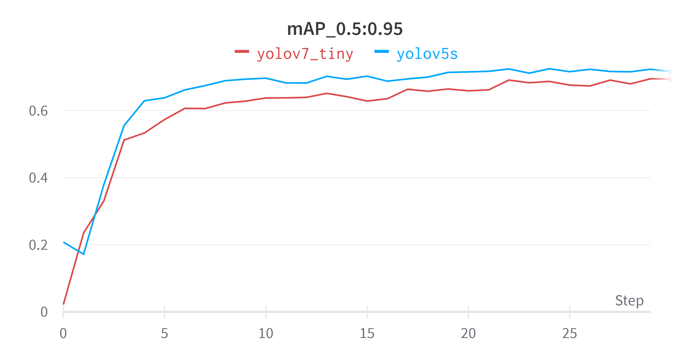
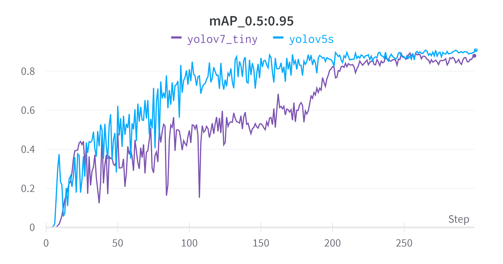

## Сервис для распознавания вовлеченности студентов

Выполнили: Оганян Роберт, Рухович Игорь, Тронин Дмитрий.

Запуск демонстрации `streamlit run ui.py` из корня

Для сравнения были опробованы две модели одностадийной детекции (так как двухстадийные модели вроде Faster-RCNN работают недостаточно быстро для детекции в реальном времени):

* Yolov5s (2020)
* Yolov7_tiny (2022)

| Модель      | FPS  | map@0.5:0.95  детекция лица | map@0.5:0.95  распознавание  вовлеченности | Количество  параметров (миллионы) | FLOPs (миллиарды) |
| ----------- | ---- | --------------------------- | ------------------------------------------ | --------------------------------- | ----------------- |
| Yolov5s     | 36   | 0.721                       | 0.898                                      | 7.06                              | 16.1              |
| Yolov7_tiny | 32   | 0.701                       | 0.879                                      | 6.06                              | 13.3              |

## Demo

## Литература

1. R. Girshick, J. Donahue, T. Darrell, J. Malik Rich Feature Hierarchies for Accurate Object Detection and Semantic Segmentation. CVPR 2014. URL: https://arxiv.org/abs/1311.2524

2. R. Girshick. Fast R-CNN. ICCV 2015. URL: https://arxiv.org/abs/1504.08083

3. S. Ren, K. He, R. Girshick, and J. Sun. Faster R-CNN: Towards realtime object detection with region proposal networks. In NIPS, 2015. URL: https://arxiv.org/abs/1506.01497

4. Redmon J., Divvala S., Girshick R., Farhadi A. You Only Look Once: Unified, Real-Time Object Detection, 2015. URL: https://arxiv.org/pdf/1506.02640

5. Redmon J., Farhadi A. YOLO9000: Better, Faster, Stronger, 2016. URL: https://arxiv.org/pdf/1612.08242

6. Redmon J., Farhadi A. YOLOv3: An Incremental Improvement, 2018. URL: https://arxiv.org/abs/1804.02767

7. Bochkovskiy A., Wang C., Liao M. YOLOv4: Optimal Speed and Accuracy of Object Detection, 2020. URL: https://arxiv.org/abs/2004.10934 